# R-netflix-analytics
## Netflix User Behavior Analysis with R
### Project Overview

As part of this project, we conducted an in-depth analysis of a dataset related to Netflix users.  
The primary objective was to better understand viewing habits, user preferences, and general usage trends on the platform.

### Technologies Used
- **Language**: R  
- **Key Libraries**:
- `ggplot2` for data visualization
- `dplyr` for data transformation
- `corrplot` for visualizing correlation matrices
- `GGally` for multivariate analysis
- `tidyverse` meta-package ,for data science
- `Fisher’s Exact Test`
- `Chi-Square Test`
### to import libraries,we used the following command 
```r
library(ggplot2)
library(dplyr)
library(corrplot)
library(GGally)
library(tidyverse)
```
### To load the dataset into R
```r
d <-read_csv("netflix_users.csv")
```
### General Overview of the Dataset  
```r
str(d)
```
    
    
### Dataset Dimensions and Structure  
```r
dim(d)
```
            

### Detailed Information on Dataset Columns  
```r
colnames(d)
sapply(d, class)
```
    

### Sample Data Display and Inspection       
                   
```r       
head(d)       
tail(d)      
```                   
       
   
### Count of Occurrences for Each subscribed_type      
```r      
table(d$subscription_type)      
```       
 
   
### Count of Occurrences for Each Gender    
 
```r
table(d$gender)
```
      
       
### Visual Representation of Subscriber Distribution by Country    
  
```r   
ggplot(d, aes(x = country)) +
  geom_bar() +
  theme_minimal()
```    
 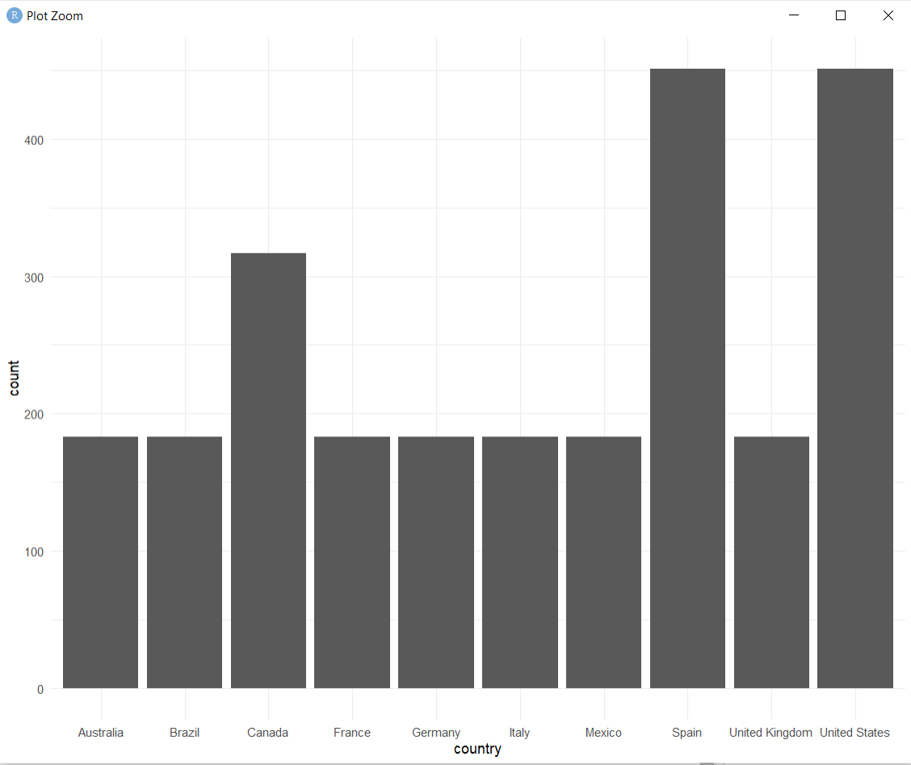     
   
### User Count by Subscription Type    
  
```r   
ggplot(d, aes(x = subscription_type)) +
  geom_bar() +
  theme_minimal()
```       
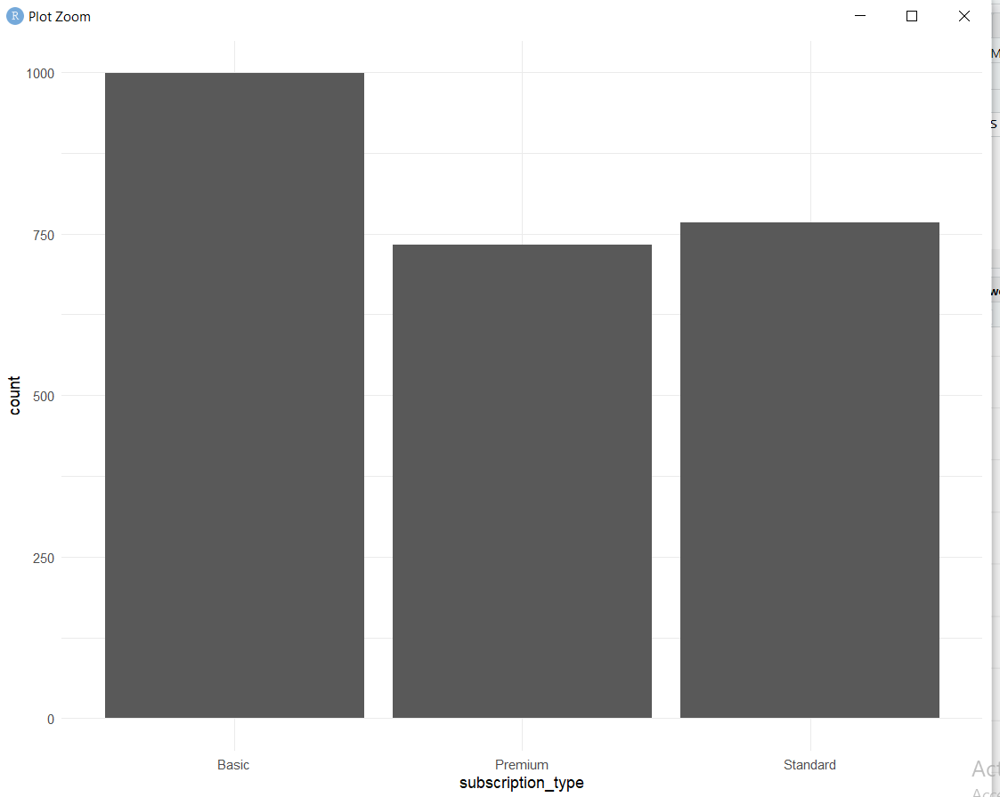     
    
### Age Distribution Overview    
    
```r   
hist(d$age, main = "Age Distribution", xlab = "Age")
```    
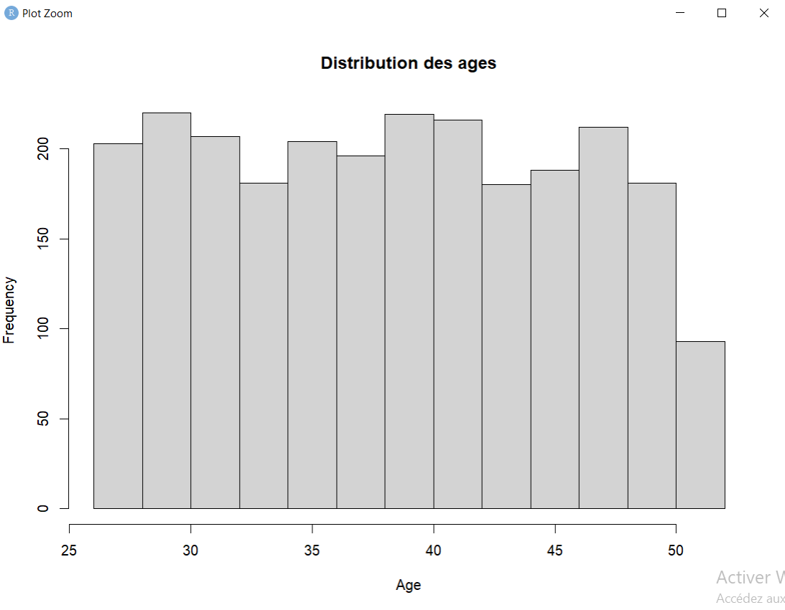   
   
### Age Distribution with Density Plot   
  
```r    
ggplot(d, aes(x = age)) +
  geom_histogram(aes(y = ..density..), binwidth = 2, fill = "skyblue", color = "black") +
  geom_density(color = "red", size = 1) +
  theme_minimal()
```
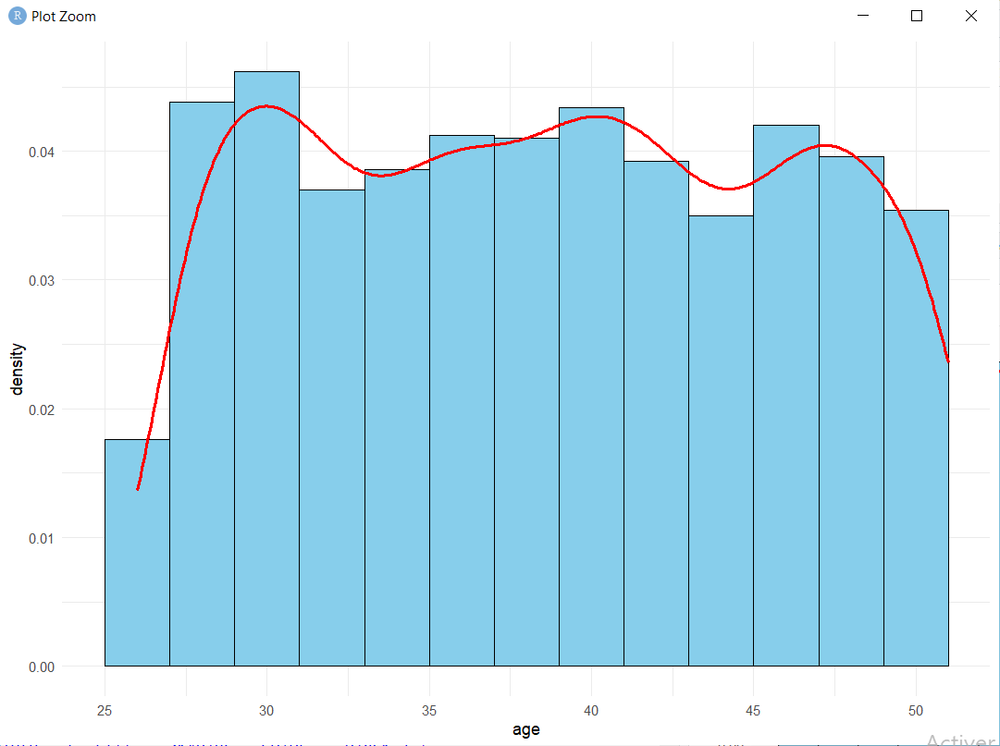    
  
### Boxplot Representation of Age Distribution    
   
```r    
ggplot(d, aes(y = age)) +
  geom_boxplot() +
  theme_minimal()
```    
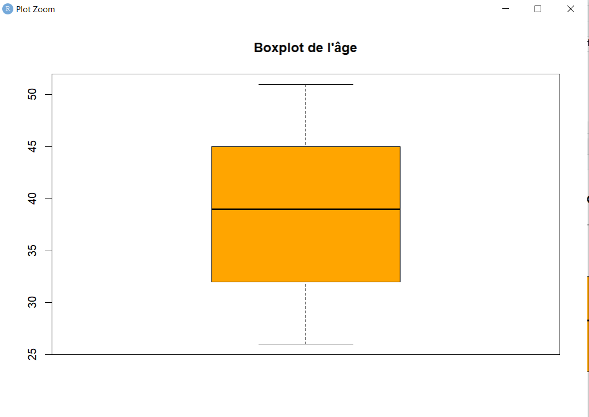   
  
### Age Distribution by Subscription Type    
   
```r    
ggplot(d, aes(x = subscription_type, y = age)) +
  geom_boxplot() +
  theme_minimal()
```
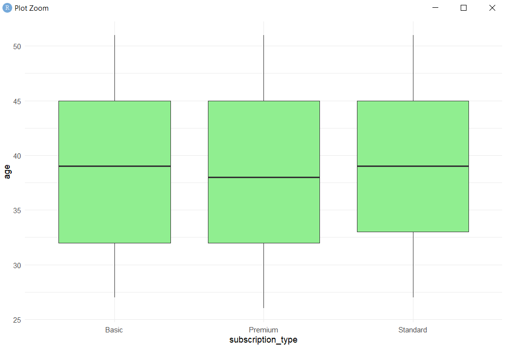    
   
### Device Distribution Represented by Pie Chart   
   
```r    
device_counts <- d %>% count(device)

ggplot(device_counts, aes(x = "", y = n, fill = device)) +
  geom_col(width = 1) +
  coord_polar(theta = "y") +
  theme_void() +
  labs(fill = "Device")
```    
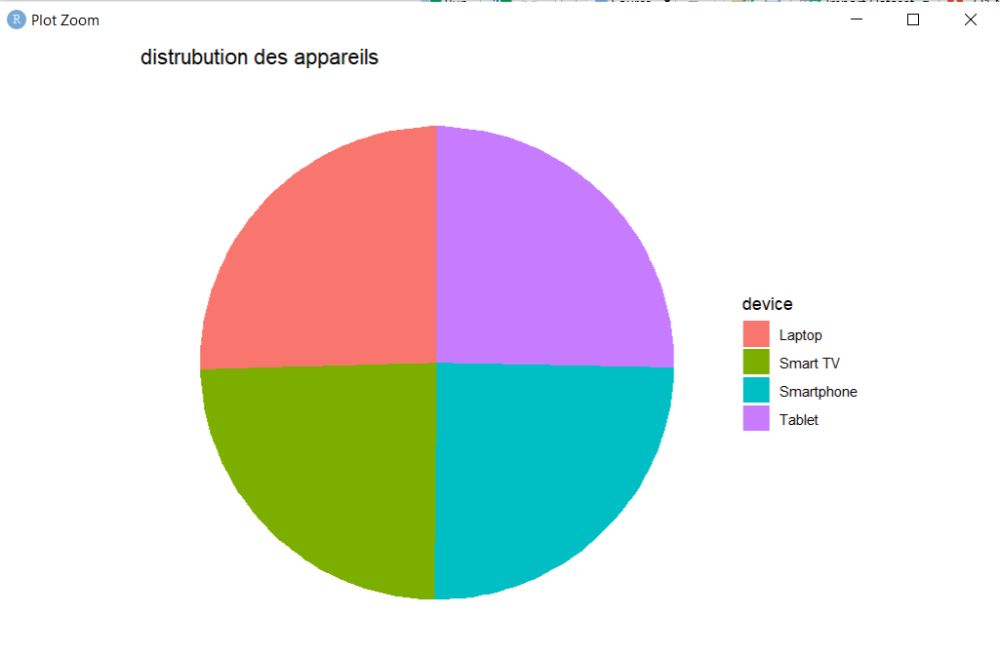    
  
### Subscription Duration Distribution 
   
```r    
hist(d$subscribed_duration, main = "Subscription Duration Distribution", xlab = "Duration (days)")
```   
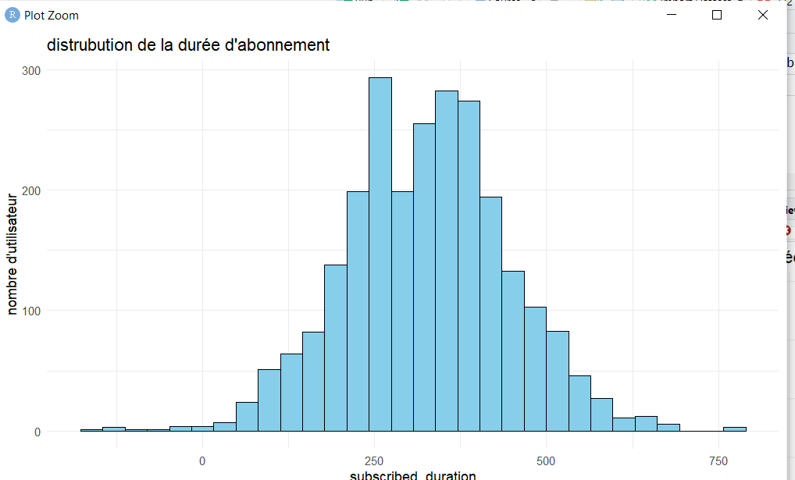  
   
### Monthly Revenue Comparison by Gender     
    
```r   
ggplot(d, aes(x = gender, y = monthly_revenue)) +
  geom_boxplot() +
  theme_minimal()
```    
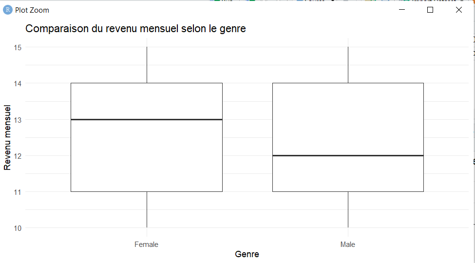    
   
### Comparison of Subscription Duration by Device    
    
```r    
ggplot(d, aes(x = device, y = subscription_duration)) +
  geom_boxplot() +
  theme_minimal()
```    
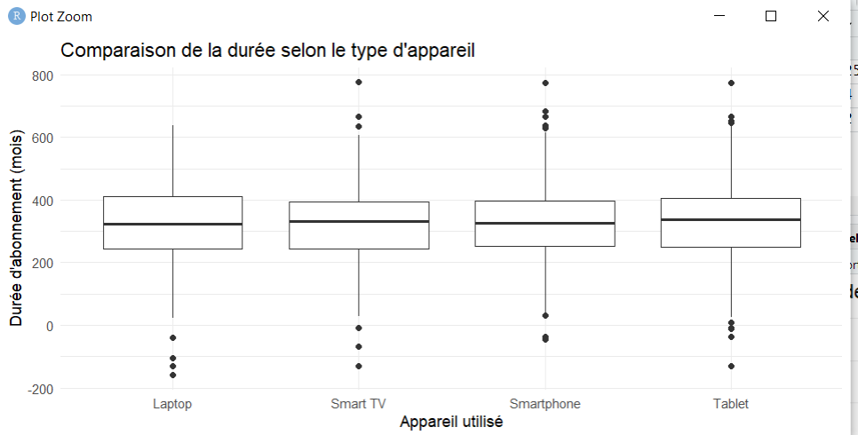     
   
### Outliers   
   
are unusual values that differ greatly from most other data points. They can affect analysis results and may need to be removed or treated separately.   
```r
finding_outliers<- function(data, variable_name) {
   Q1 <- quantile(data[[variable_name]],0.25,na.rm=TRUE)   
   Q3 <- quantile(data[[variable_name]],0.75,na.rm=TRUE)    
   IQR=Q3-Q1     
   lower <- Q1 - 1.5 * IQR    
   upper <- Q3 + 1.5 * IQR
   outlier <- data[data[variable_name] < lower | data[variable_name] > upper, ]
   return(outliers)
```
    
**Examples**    
   
    
       
### Correlation Analysis Between Age and Subscription Duration      
   
**Correlation**   
measures the strength and direction of the linear relationship between two variables. It helps determine whether changes in one variable are associated with changes in another.       
```r
ggplot(d, aes(x = age, y = subscribed_duration)) +   
  geom_point(alpha=0.6) +
  theme_minimal()
```
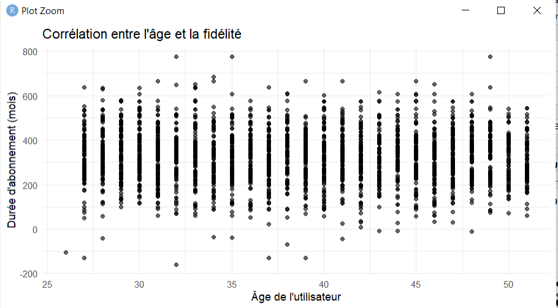    
   
**Conclusion:**       
The user's age has no significant influence on the duration of their subscription. There is little to no linear correlation between these two variables.         
        
### Visual Relationship Between Monthly Revenue and Customer Lifetime Value (CLV)   
   
A scatter plot is used to explore the relationship between two numeric variables. It allows us to visually assess patterns, trends, and potential correlations in the data.      
```r   
ggplot(d, aes(x = monthly_revenue, y = CLV)) +
  geom_point(alpha = 0.6, color = "steelblue") +
  geom_smooth(method = "lm", color = "red") +
  theme_minimal() ,
```
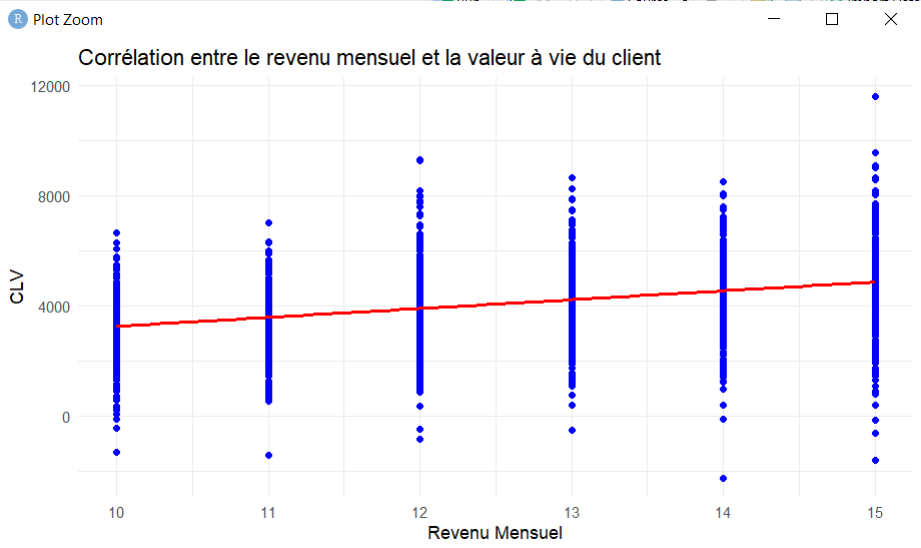    

**Conclusion:**   
The scatter plot shows a slight positive trend between monthly revenue and CLV, as indicated by the red regression line.
Clients with higher monthly revenue tend to have a higher CLV, although the relationship remains moderate.    
   
### Correlation Between Monthly Revenue and Subscription Start Month    
    
Correlation analysis can reveal if certain subscription plans are more popular during specific periods (e.g., premium offers subscribed at year-end).    
```r
cor(d$monthly_revenue, d$start_month)    
```
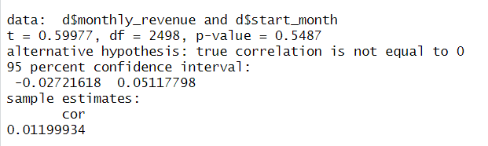   
   
**Conclusion:**    
The correlation between monthly revenue and subscription start month is very weak (r = 0.012).
The p-value (0.5487) indicates that this correlation is not statistically significant.    
   
### Correlation Between Customer Lifetime Value (CLV) and Subscription Duration    
    
```r   
cor(d$CLV, d$subscribed_duration)   
```
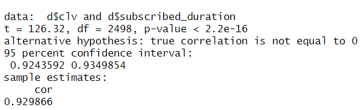    
   
**Conclusion:**             
The correlation coefficient (r = 0.93) shows a very strong positive relationship between subscription duration and CLV.
With a p-value < 2.2e-16, this correlation is statistically highly significant.     
   
###  Correlation Coefficient Heatmap    
   
A correlation heatmap visually displays the strength and direction of relationships between multiple numerical variables using color gradients. It helps quickly identify strong positive or negative correlations within the dataset.     
   
```r   
# Calculate correlation matrix (numeric columns only)   
cor_matrix <- cor(d[sapply(d, is.numeric)], use = "complete.obs")   
   
# Plot heatmap   
corrplot(cor_matrix, method = "color", type = "upper",    
         tl.col = "black", tl.srt = 45,      
         addCoef.col = "black", number.cex = 0.7)     
```
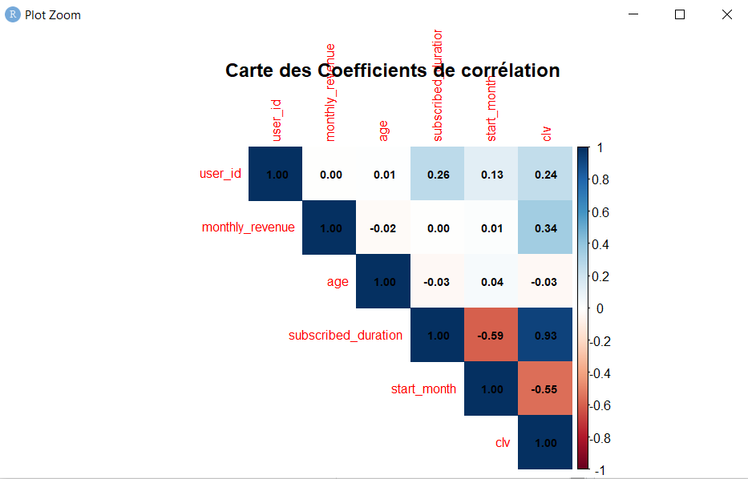    
   
### Fisher’s Exact Test on Country vs Subscription Type    
   
Fisher’s Exact Test is used for analyzing the association between two categorical variables in a 2x2 contingency table, especially when sample sizes are small. It helps determine if there is a statistically significant relationship between country and subscription type.        
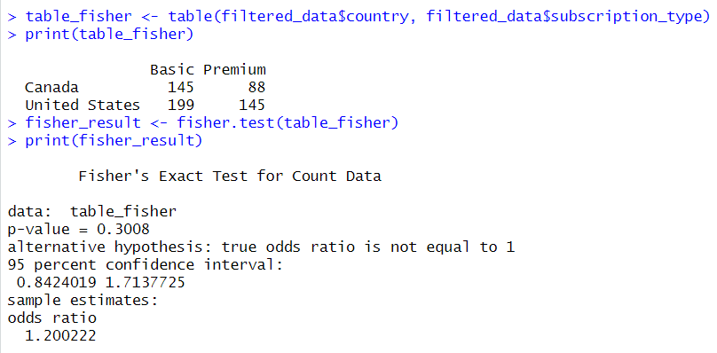    
    
**Conclusion:**   
The confidence interval [0.8424; 1.7138] includes 1, and the odds ratio (1.2) suggests only a slight tendency for users from certain countries to choose specific subscription types. However, this difference is not statistically significant, indicating no meaningful effect of country on subscription choice.    
   
### Chi-Square Test of Independence on Gender vs Subscription Type    
   
The Chi-Square test examines whether two categorical variables are independent. It assesses if the subscription type depends on the user’s gender.       
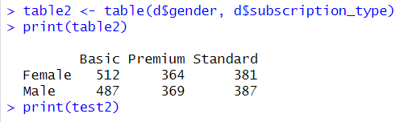    
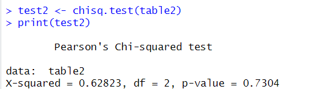    
    
**Conclusion:**   
With a high p-value (0.7304), there is no significant association between gender and subscription type. Statistically, a user’s gender does not influence their choice of subscription.    


 


